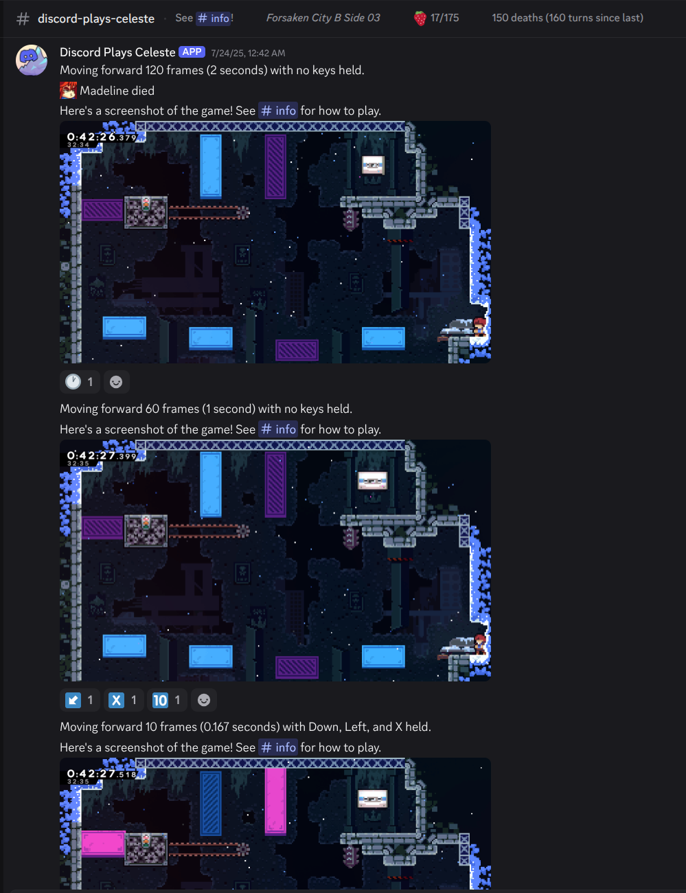

# Plays Celeste

This project was originally named "Discord Plays Celeste" as a Discord bot to allow distributed gameplay of [Celeste](https://www.celestegame.com/) by presenting the game one screenshot at a time with interactive controls. However, I've also expanded to a Twitch bot controlled by the same Celeste mod.

## What is this?
This is a little project to allow distributed gameplay of [Celeste](https://www.celestegame.com/) on various social platforms not... really meant for it. The game is presented one screenshot at a time, while users vote to decide on the next keys to hold and how many frames to advance the game. This is, in a way, similar to Celeste TAS runs, except in real time; in fact, I have tooling in place to convert the final run to a TAS!

  
  

The bot is made of primary two components:
- The Discord bot backend in Typescript that sends screenshots, takes user input, and logs events.
- A mod for [Everest](https://everestapi.github.io/) to interface closely with the game (manage when frames are advanced, overwrite what keys are pressed, readback the output, etc). It targets Everest version 5635.

The project is meant to run headless on a Linux server with software Vulkan rendering. It isn't tied to a specific renderer, but it currently only works on Linux because it uses Unix sockets to communicate.

## Features:
- TAS-like frame-perfect input handling
- Native screenshot/buffer readback so the game can run headless
- Robust (ish?) socket communication
- Manual override for game control (e.g. settings bindings)
- Collected strawberry tracking
- Death tracking
- Room and chapter completion tracking
- Faster-than-realtime game updates
- Event logging for user statistics and eventual TAS conversion
- Live configuration reloading from disk
- A bunch of silly easter eggs for cases like game crashes, trying to exit the game, etc.

## How to play over Discord
The gameplay loop is as follows:
- The bot sends a message with a screenshot of the game
- Users react with emojis that have different purposes (see below)
- Once there is a valid reaction state, a certain number of users have reacted to at least one action, and it's been a few seconds since the latest reaction, the game will advance and repeat.

Valid reactions:
- Regional indicators (e.g. ) cause their corresponding key to be held down
- Arrows (e.g. ) hold down the corresponding arrow (diagonal arrows also work)
-  holds enter
-  holds tab
-  holds escape
- Numbers (e.g. ) progress the game the corresponding number of frames
-  multiplies the frame count by 6 (effectively turning it from frames to tenths of a second)
- Clocks (e.g. ) progress the game the corresponding number of seconds
  - Half-hour increments correspond to half-seconds, e.g.  is 3.5 seconds.

Keys are only held until the next loop, so they must be repeated every time they're still needed. Progress intervals stack.

## How to play over Twitch
TODO; this is a work-in-progress

## TODO
- Finish Twitch integration